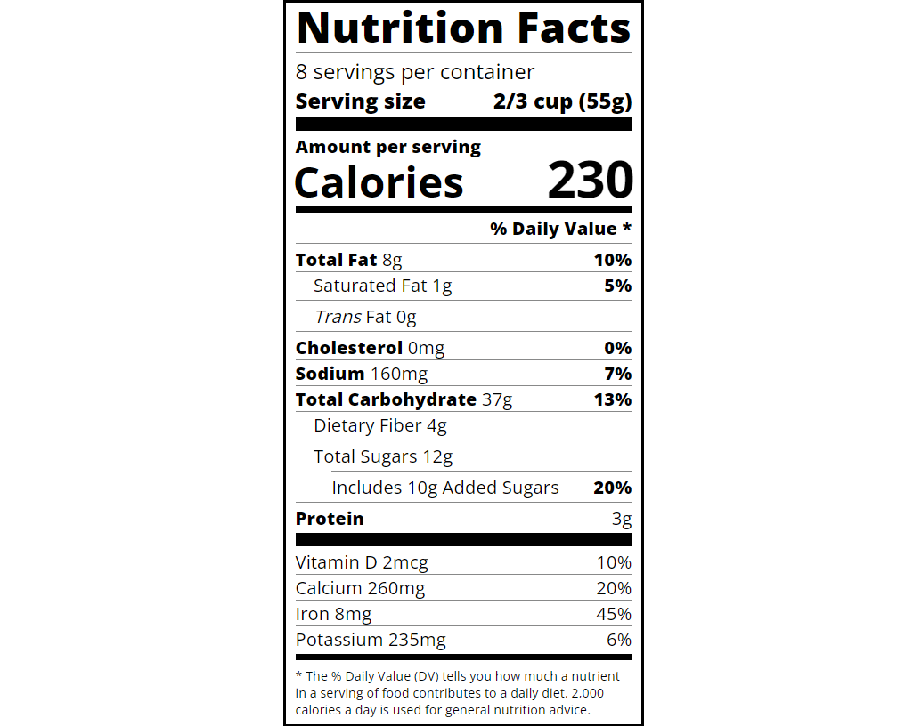

# Project Name

> A nutrition label webpage built using Typograghy and CSS.



Additional description of the project and its features.

## Built With

- HTML5 form elements
  - `h1`, `div`, `span`, `p`.
- CSS properties
  - CSS Background for page aesthetic using
    `background-color`.
  - CSS Typography properties
    `letter-spacing`, `font-size`, `font-style`, `font-family`, `text-align`, etc
  - CSS Box Model properties
    `border-bottom`,`padding`, `margin`, `width`, `box-sizing`, `border-bottom`, etc
  - CSS Displaying properties
    `display`,
  - CSS Flexbox properties
    `flex-flow`, `align-items`, `justify-content`.
- Linters
  - [Prettier](https://prettier.io/),
  - [Stylelint](https://stylelint.io/).
- GitHub Action

## Live Demo

[Live Demo Link](https://fcc-nutrition-label-ismail.netlify.app/)

### Development (Running locally)

- Clone the project

```bash
git clone git@github.com:ismailadekunle/08-fcc-nutrition-label.git

```

- Install Dependencies

```bash
yarn install
```

To run StyleLint by itself, you may run the lint task:

```bash
yarn lint:check
```

Or to automatically fix issues found (where possible):

```bash
yarn lint
```

You can also check against Prettier:

```bash
yarn format:check
```

and to have it fix (to the best of its ability) any format issues, run:

```bash
yarn format
```

You can also check against Webhint:

```bash
yarn hint
```

## Style Guides

## Style Guides

- [CSS Style Guide](http://udacity.github.io/frontend-nanodegree-styleguide/css.html)
- [HTML Style Guide](http://udacity.github.io/frontend-nanodegree-styleguide/index.html)
- [Git Style Guide](https://udacity.github.io/git-styleguide/)

## 👤 Author

- Github: [@ismailadekunle](https://github.com/ismailadekunle)
- Twitter: [@ismailadekunle](https://twitter.com/ismailadekunle)
- Linkedin: [@ismailAdekunleJIMOH](https://www.linkedin.com/in/ismailAdekunleJIMOH/)
- Freecodecamp: [@ismailadekunle](https://www.freecodecamp.org/ismailadekunle)

## 🤝 Contributing

Contributions, issues and feature requests are welcome!

Feel free to check the [issues page](../../issues).

## Show your support

Give a ⭐️ if you like this project!

## Acknowledgments

- Freecodecamp: (https://www.freecodecamp.org/learn/2022/responsive-web-design/#learn-typography-by-building-a-nutrition-label)

## 📝 License

[MIT licensed](./LICENSE).
